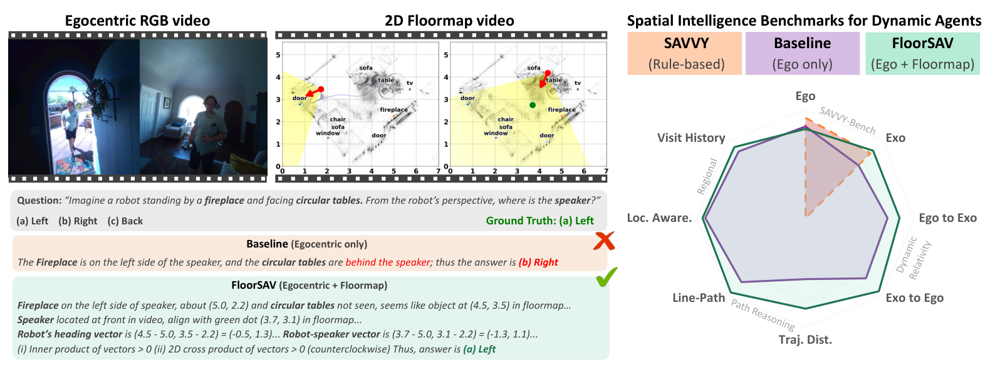

# FloorSAV

### Elucidating Spatial Audio-Visual Context with 2D Floormap for AV-LLMs

**Kyeong-Rae Kim · Sungnyun Kim† · Tae-Hyun Oh†**

KAIST · † Corresponding authors

[**Project Page**](https://byulharang.github.io/FloorSAV/) · [**Paper (PDF)**](assets/figures/paper.pdf) · **arXiv: Coming soon** · [**SAVED-Bench**](benchmark/) · [**MIT License**](LICENSE) · [**BibTeX**](#citation)

FloorSAV gives audio-visual language models an explicit spatial reference: a **dynamic 2D floormap synchronized with egocentric video**. It brings geometry, camera motion, spatial audio, and object landmarks together for reasoning about viewpoints, places, and paths—without fine-tuning.



## Abstract

While 3D spatial reasoning in dynamic egocentric environments is crucial for embodied intelligence, audio-visual large language models (AV-LLMs) lack explicit mechanisms to process and internalize global geometry directly from raw sensory streams. Existing approaches either require costly fine-tuning or underutilize the model’s cross-modal reasoning capacities. In this paper, we propose FloorSAV, a novel framework that explicitly grounds spatial audio-visual context by rendering a dynamic 2D floormap. By integrating 3D point clouds, camera trajectories, spatial audio cues, and semantically grounded object landmarks, we inject this floormap into the AV-LLM as a synchronized stream with an egocentric video. AV-LLMs utilize their multi-modal capabilities to jointly reason over visual, auditory, and geometric cues in a single inference with floormap interpretation guidance. We further introduce SAVED-Bench (Spatial Audio-Visual Egocentric Benchmark with Dynamic Agents), constructing essential tasks of spatial capability in real-world scenarios: dynamic relativity, regional, and path reasoning QAs. FloorSAV improves AV-LLMs’ spatial reasoning on various tasks from both SAVED-Bench and SAVVY-Bench. Studies with ground-truth floormaps demonstrate the substantial potential of FloorSAV with accurate spatial information.

## SAVED-Bench

The public release contains **1,988 questions from 55 scenes**, covering **nine tasks in three categories**.

| Category | Tasks | Questions |
|---|---|---:|
| Dynamic relativity | Ego-to-Exo and Exo-to-Ego direction and distance | 800 |
| Regional reasoning | Location Awareness; Visit History | 592 |
| Path reasoning | Line-Path Search (static / dynamic); Trajectory Distance | 596 |

Available in [`benchmark/`](benchmark/):

- **[Questions and answers](benchmark/qa.json):** question text, multiple-choice options or numeric ground truths, scene identifiers, and time intervals.
- **[Reported results](benchmark/results.json):** the paper’s Table 1 scores for Baseline, FloorSAV, Partial GT map, and Full GT map.
- **[Task generators](benchmark/generation/):** construction of all nine question types and geometric answer computation, with generation inputs and scene metadata. Raw SAVVY trajectories are supplied separately.
- **[Release utility](benchmark/build_release.py):** public-schema packaging and validation.

See the **[benchmark documentation](benchmark/README.md)** for the data format, task definitions, and generation instructions.

### Reported results

SAVED-Bench · Gemini-3.6-Flash · No fine-tuning

| Evaluation | Baseline | FloorSAV | Partial GT map | Full GT map |
|---|---:|---:|---:|---:|
| Dynamic relativity | 42.2 | **48.7** | 58.1 | 56.6 |
| Regional reasoning | 89.4 | **93.4** | 92.9 | 96.8 |
| Path reasoning | 50.0 | **60.0** | 63.5 | 65.6 |
| Overall (QA-weighted) | 58.3 | **65.3** | 69.8 | 71.3 |

Scores use accuracy or AbsMRA on a 0–100 scale; higher is better. Category scores average tasks. Values are preserved at the paper’s reported one-decimal precision. FloorSAV improves all three category averages, while individual task results vary. Ground-truth map studies show the potential of more accurate spatial information; they are separate evaluation conditions.

## Citation

```bibtex
@misc{kim2026floorsav,
  title = {FloorSAV: Elucidating Spatial Audio-Visual Context with 2D Floormap for AV-LLMs},
  author = {Kim, Kyeong-Rae and Kim, Sungnyun and Oh, Tae-Hyun},
  year = {2026},
  url = {https://byulharang.github.io/FloorSAV/}
}
```

## License

This repository is released under the [MIT License](LICENSE). Separately obtained source datasets retain their original licenses.

## Code release

The **SAVED-Bench data, task generators, and reported results are available now**. The remaining **FloorSAV framework and inference code will be released later**.
